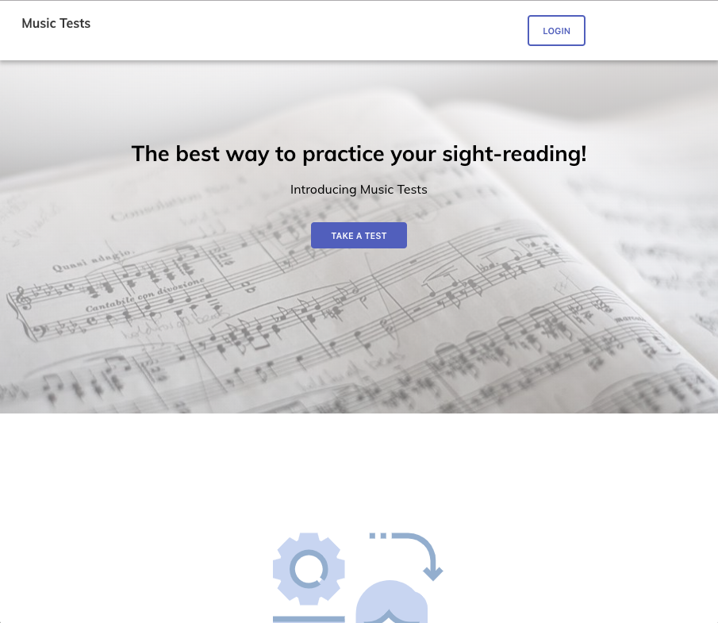
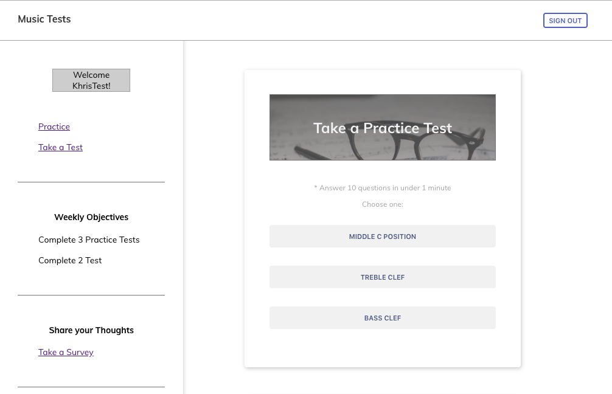
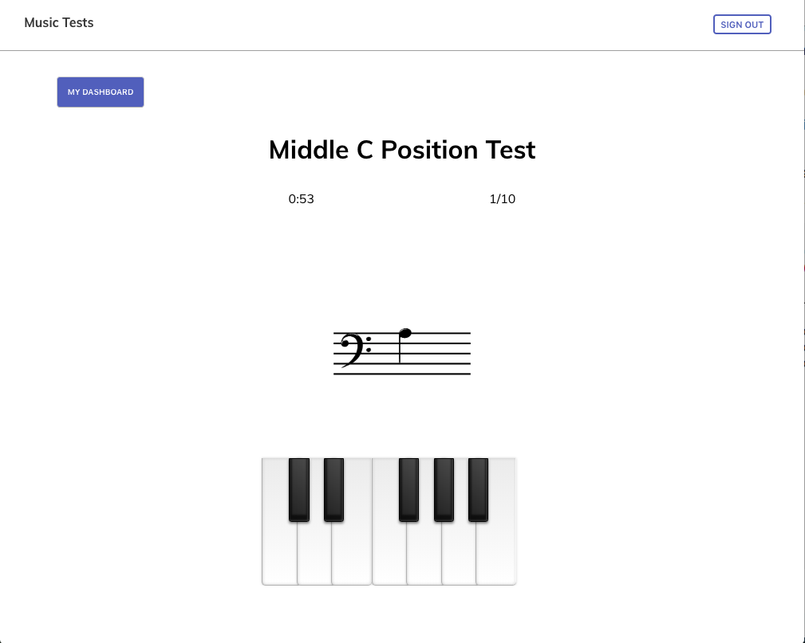
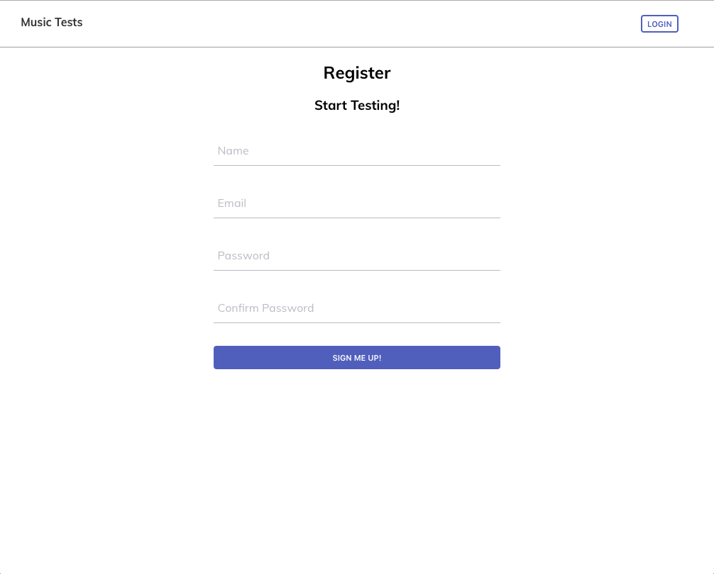
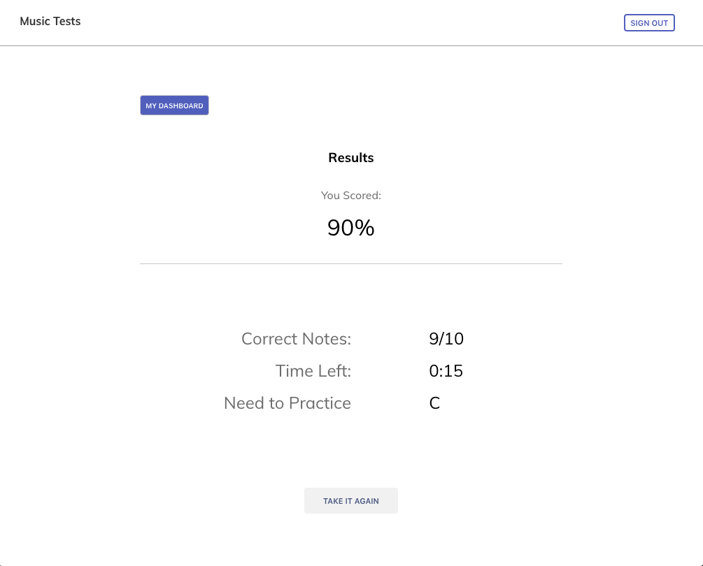

## [Music Tests](https://stark-dusk-66511.herokuapp.com/)

#### Description

With this web app, a student can practice his or her sight-reading skills with different timed tests.

#### Features

-	create users to be able to sign in
-	sign in using authentication
- view thier own dashboard where one can navigate to different tests
-	get results from the test they have taken
- can fill out a survey of what they think

----
#### User Flow

When arriving to the landing page, a user can immedietely jump into the test taking portion of the application without initially registering. Otherwise, they can scroll down and view the current features of the app.

They may also choose to register for an account on the Landing page and be taken directly to the Dashboard page. The Dashboard is where they can choose between a different tests to practice their skills.

The tests themseleves cylce through different notes and provides a keyboard which they can press to designate a particular note. These tests are made for students who can practice both note naming and navigating a piano keyboard. The same keyboard area will alert them if they got the answer correct or incorrect.

If a person navigates from the Landing page directly to the test taking portion and completes the test, they will need to register for an account in order to view thier results. 

After creating an account, the user will be able to see the results of the test and see where they need to improve. Alternatively, there is also an option to retake the test.

----

Technologies Used 

- React
- Redux
- CSS
- Node.js
- MongoDB